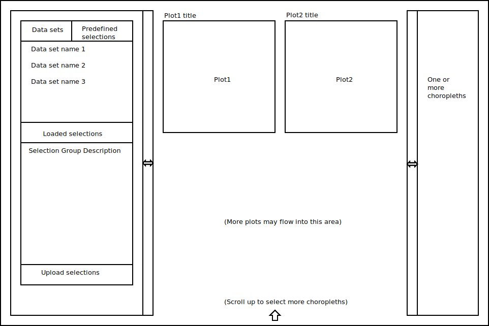
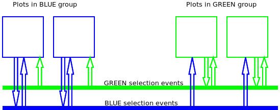

# ReScatter Guide
## Introduction

The ReScatter framework is designed to allow the rapid creation of a grid based layout of large interactive
(brushable) scatter plots, with the option of linked thematic maps and plugins allowing the external analysis
of selections.

## Key Concepts and features

1. Selections can be created in a single scatter plot (or a linked thematic map) and will be displayed
on all linked plots.

2. Plots can be placed in groups<sup>`*`</sup> and selections are generated on a group basis.

3. Selections can be mapped between plot groups.

4. The scatter plots support approximately 10^5 points and rely on WebGL for performance. Density plots are
generated on the fly.

5. Configuration of the site is done via static JSON based configuration (described below) which can include some
 functions to permit complex mapping of selections.

6. Optional thematic maps linked to plots can be configured to give insight into spatial and temporal data relationships

7. Optional ontologies linked to plots can be configured as an aid to navigating and selecting within a complex hierarchy.

8. Predefined point group selections

<sup>`*`</sup> All plots in a group must have the same number of points and the same ordering.

## Known deficiencies

1. The coupling of the components is currently too tight and the design needs to be split into more abastractions

2. No integration of d3/plotly based plots. This would be useful to allow the addition of plot axes.

3. Plot coordinates must be zero centered (could be easily fixed)

## Prerequisites

In order to use ReScatter to build websites effectively the end use should have at least a basic understanding of HTML,
Javascript in order to configure a ReScatter page. Familiarity with [Bootstrap](http://getbootstrap.com/) and CSS are valuable.

## Example plots

The release includes a number of examples that introduce various features of the framework. These a listed here:

| Plot name | Features introduced |
| --- | --- |
| example_mnist_dualview | Linked plots. Deriving plot properties from metadata. Mapping selection between groups |
| example_mnist_dualview_thematic | As above plus a thematic map for spatial information |
| example_mnist_parallelplots | Linked plots of various dimensionality reduction techniques applied to MNIST data with a thematic map |
| example_mnist_parallelplots_main | Alternative layout: linked plots with a central main plot.

You can base your own sites on these examples and with the help of the detailed [site configuration](#rescatter-site-configuration)

## ReScatter Web Page Model

ReScatter configuration addresses both configuration of plot layout layout and the configuration of the

#### Page layout - overview

A page comprises a block of widgets on the left that allow selection selection/editing and ontology navigation,
various linked scatter plots are in the central section and optional thematic maps (a.k.a. choropleths on the right).
ReScatter uses a div based layout system that may be combined with bootstrap to get grids of plots.
The example below uses bootstrap to arrange the plots next to each other - otherwise they appear one above the other.

In its current form the widgets shown are not configurable.



The plots, choropleths, ontology and the mapping of selections to maps is controlled by the site configuration.

#### Plot selection model - overview

Selections can be generated by brushing and mouse clicks as well as being to be able to load predefined selections.
 The _Re_ in ReScatter stands for _"Responsive"_ and the responsive comes from the selection model that allows plots to
 be linked and vary their display properties in response to incoming selections.

The most effective way understand the function and configuration of plot selections is to envisage each named
selection as an event on a channel. Plots (and choropleths) can listen to any channel but only plots in the
channel group can generate selection events on that channel. A selection event comprised a set of point indexes
and information concerning the selection context. Plot in the same group must have the same
data points in in the same order to created equivalent selections.



In this diagram we have two plot groups _BLUE_ and _GREEN_. In this the plots in all groups have been configured to listen
to selection events om both the _BLUE_ and _GREEN_ selection channels but only selection event generation is exclusive to the
 the named group.

## ReScatter Site Configuration details

A web page built with ReScatter is Site configuration is JSON based.
The examples are intended to provide useful starting points for and end user.
Details of the configuration elements are provided below.

### SiteTitle

String loaded into the text of an html element with id 'title'

### Layouts

A list of data layouts that can be loaded on the site. Each layout has a unique numeric id, title and description.
The title is displayed in the 'Data Sets' tab. The description is purely for documentation purposes.

| Layout key | purpose |
| --- | --- |
| `id` | integer, unique numeric id - the display order in the 'Data Sets' tab |
| `title` | text, name of layout to display in the 'Data Sets' tab |
| `description` | text, a description of the layout, not displayed on the site |
| [`dataMaps`](#data-maps---per-point-float-values) | per point float values |
| [`plots`](#plots) | list of JSON objects, each object is a plot description including plot coordinates and meta data |
| [`choropleths`]| |


### Data maps - per point float values

Per plot point float values are typically large, possibly poorly compressible, data files. For performance reasons ReScatter
configures and handles these data separately from the other plot meta data. The files are
downloaded from the server via a caching proxy only when needed. This differs from
the points and basis meta-data that are fetched as soon as a plot is loaded.

`dataMaps` assigns a unique name to each of the data these names may be used to define [selection mappings](#mapping-selections)
that defined how a plot's appearance changes in response to an incoming selection.
In a more complex case each plot may have multiple files associated with. In The files should be saved as a
nrrd raw file (see for example the `utils\make_nistexample.py` that packs the raw MNIST data for 10000 images into an nrrd).

__Performance tip:__ When serving a ReScatter website it is a good ide to enable gzip compression for the .nrrd and .json meta data files.

Configuration is as follows

```
        dataMaps:[
            {id: <dataName1>, filePath: <URI1>},
            {id: <dataName2>, filePath: <URI2>},
            etc...
        ],
```

### Plots

Each layout contains one or more plots that are placed into a simple grid or a grid with a central main plot.

| Plot key | purpose |
| --- | --- |
| `id` | string: Short unique name for the plot displayed at the top left of the plot |
| `layoutTarget` | enum value" either ReScatter.control.LayoutController.LayoutTarget.GRID or MASTER or SPACER. [Details on positioning](#positioning)|
| `points` | URI: A JSON file containing the x,y coordinates of the plot. `{"dims": 2, "tsneMap": [[x0,y0],[x1,y1]...]}` |
| `props` | URI: A JSON file containing per point meta data `{"voxel_props": {"<prop_name1>": [list of props per point], "<prop_name2>": [list of props per point],...}}`
| [`plotProps`](#basic-plot-configuration) | object: controls the plot appearance and selection behavior [plotProp details.](#plotProps) |
| `selectionOut` | string: Identifies the permanent [plot selection group](#selection-groups-and-plots) |
| `dynamicSelectionOut` | string: Identifies the transient [plot selection group](#selection-groups-and-plots) |
| `selectionIn` | object: Map incoming selection to display changes |
| `dynamicSelectionIn` | object: Map incoming selection to display changes |
| [`incomingSelections`]()


#### Basic plot configuration

This is a JSON object that specifies the mapping between point __meta-data__ and the point display.

plotProps has a number of fixed keys as described in the table below

| plotProps key | purpose |
| --- | --- |
| `id` | Assign a unique id to plot points from the meta data |
| `symbol` | Assign a (human readable) symbol to plot points from the metadata (this will be displayed by mouse over) |
| `primary` | The default meta data property for property based selections (in the context menu)
| `color` | The point colour - an RGB value - eg 0xFF0000 is red

The value can be one of the following types:

1. _string_: indicates an attribute in the point meta-data
2. _object_:
3. _function_: derive the property from the meta data using a javascript function

###### plotProp examples

```
plotProps: {
 id: "label",
 symbol: "label",
 primary: "label",
 color: 0x6C7B8B,
}
```

#### Selection groups and plots

Each plot is a member of a uniquely named plot group. All plots within a group must have
the same number of points with the same ordering. In the example _example_mnist_parallelplots_
several different embeddings of the first 10000 MNIST images are shown.

Plots in the same group generate selections with the same group label

### Selections

A selection is a set of points on a plot defined by user mouse interaction.

#### Defining selections

The plot context menu (right mouse button) allow you to change the selection method.
The following options are currently supported:

1. Neighborhood - n neighbors of a seed point where n is configurable
2. Drawing - either circle, rectangle or freehand drawing options are supported
3. Property based selection - select all points where a given meta-data property is of a certain value

#### Broadcasting selections

Selection events are broadcast as a result of user interaction on the plots as described in [Defining selections](#defining-selections).
The originating plot and any other plot can listen to these selections and map them to local behavior.
The following parameters are broadcast in a selection event and can be used to define the response (see [].

###### Plot selection event parameters
| parameter | information |
| --- | --- |
| `values` | A list of point indexes (the index order is the point order) |
| `props` | The point meta data |
| `selectionColor` :-1: | A default color set by the selection generator |

:-1: Deprecated - the functionality can be achieved by other means

###### Original plot data (`dataMap`):

As well as the incoming `values` and `props` the configuration can contain floating point data for each point
in the plot in a `dataMap`. In the case where the source and target plots represent different axes of the dataMap
matrix plot properties may be assigned by converting row or column sums or averages to a color scale or point size.
More details of the use of the `dataMap` can be found in the [Mapping pipeline](#mapping-pipeline) section.

#### Mapping selections

Selection mapping configuration is in the `propMap` object
The internal selection mapping model is a two step process:

1. Grouping: The set or points affected by the selection in the target plot are defined according to the `group` configuration [See Grouping](#grouping)
2. Property mapping: Based on the incoming `value`, `props` and the plot's own `dataMap` [See Property mapping](#property-mapping)

###### Mapping pipeline

A standard mapping pipeline isapplied to `group`, `color` and `size` mapping. The pipeline
contains the following steps

1. Process optional `mapOp`.

`mapOp` performs a operation on the `dataMap`. `mapOp` functions are
implemented using the fast numpy-like ndarrays from scijs with the supporting function libraries.
The `mapOp`  interprets the incoming `values` list as indices into the `dataMap` matrix and
replaces the original `values` list with the result of the `mapOp`. Not that it is essential that
the plot point ordering match the row or column ordering (as appropriate) of the `dataMap` matrix.

`mapOp` can be one of the following:

| `mapOp` value | function |
| --- | --- |
| SUMROW | the selection point indices identify rows and these are summed to a list of values |
| AVGROW | the selection point indices identify rows and these are averaged to a list of values |
| SUMCOL | the selection point indices identify columns and these are summed to a list of values |
| AVGCOL | the selection point indices identify columns and these are averaged to a list of values |
| ALLROW | return a list containing all column indices |
| ALLCOL | return a list containing all row indices |
| PASSROW | return a list of lists all the row values as per the row indices |
| PASSCOL | return a list of lists all the column values as per the column indices |

2. Process the optional user supplied `mapFn` using the `values` (indices) or the output of `mapOp` (if any)

`mapFn` revieves the (possibly transformed) `values` and the point meta data in `props`. The use is free
to add any mapping function with regard to the interactive nature of the transient selections.


###### Grouping - define target points

When a selection event generated in a source plot arrives at a target plot it the point indices
need to be converted in the context of the target plot to a selection. There are essentially two cases:

1. One-to-one grouping, default. If the source and target plot have identical indices. In this case a simple `group: {}` appears.
2. Translated grouping using `mapOp`. e.g. The source points might be derived from rows in a matrix and the target points from all columns. Typically these `mapOp`s using the ALLROW or ALLCOL `mapOp`s

###### Property mapping - define target point styles

Currently point property mapping is limited to 3 point style properties:

1. [Color](#color-mapping) `color`
2. [Size](#size-mapping) `size`
3. [Effect](#effect-mapping) `effect`


###### Color mapping

The configuration might use a SUM or AVG `mapOp` followed by mapping the resulting rang to a colorRamp.
ReScatter provides the ReScatter.utils.ColorRamp class for the latter purpose but the user
is of course free to develop their own.

Either

* return a list of RGB color values corresponding
to the target points calculated in the [Grouping - define target points](#grouping---define-target-points) step.
* or return a single RGB value to be broadcast over all points

###### Size mapping

As [Color mapping](#color-mapping) but return point sizes.

###### Effect mapping

Can be used to chang the point sprite from the default point circle.
There are currently only two other alternative shapes `X` - a cross and, and `O` a circle.

#### Advanced - multiple plot data - mapping - using `incomingSelections` and `SwitchableSelections`

The mapping to color/size presented above is based on a single `dataMap`. In some cases the end user mas wish to choose
 several different mappings based on other plot data. Switchable mapping is supported internally by the
 __ReScatter.config.PlotPropMappings__ class. To use this option the multiple data maps need to be declared:

 ```
         dataMaps:[
            {id: <dataName1>, filePath: <URI1>},
            {id: <dataName2>, filePath: <URI2>},
            etc...
        ],
 ```

Then declare a `incomingSelections` in the plot definitions:

```
    mapProps = new ReScatter.config.PlotPropMappings(
        [<dataName1>, <dataName2>, ...],
        {
            'Data selection ID1 for GUI' {
                selectionIn: {<selection configurations>},
                dynamicSelectionIn: {<dynamic selection configurations>}

            },
            'Data selection ID2 for GUI' {
                selectionIn: {<selection configurations>},
                dynamicSelectionIn: {<dynamic selection configurations>}
            }
            etc...
        }
```

In the Brainscope gui, if multiple `incomingSelections` has been configured for a plot, than a
combo box will appear in the plot context menu allowing the end user to select between the
various _"Data selection ID1 for GUI"_ titles from the configuration for that plot.

#### Permanent, transient and transitive selections

__Permanent selections__ are generated by a brushing action or mouse click. They are added to the selections list,
can be deselected and reselected at any time. The selection content is also available to selection plug-ins
through the context menu on the selection list.

__Transient selections__ are the selections generated by mouse over. These allow the use to scan the plot
for areas of interest.

__Transitive selections__ are selections generated by selecting areas on the thematic map (choropleth). The
thematic map is linked to a plot group where the transitive selection is converted to a permanent selection.
The distinction is necessary because the thematic maps do not always have a one-to-one mapping with plot points but
the end use may find the spatial information in the thematic map

#### Positioning

Plot are assigned to div containers, which form a grid when bootstrap is used, as follows

`layoutTarget: ReScatter.control.LayoutController.LayoutTarget.GRID`

Plots flow into the div based grid (only displays as a grid when using bootstrap or equivalent)
in the order in which they are defined.

`layoutTarget: ReScatter.control.LayoutController.LayoutTarget.SPACER`

Also flows into the div based grid but results in an empty space. Can be used
to ensure plots appear where desired.

`layoutTarget: ReScatter.control.LayoutController.LayoutTarget.MASTER`

There should only be one master plot - it will be placed in the single (latger) master div.


### Choropleths

Other than the basic scatter plots ReScatter allow the display of linked thematic maps. The thematic map
is linked to one or more of the plots and may be employed to give a schematic view of spatial or temporal
 relationships in plot data.

The choropleth may be a single SVG or multiple, user loadable SVG files.

TODO Document the choropleth config.


### Ontologies

In cases where the plot points form part of a hierarchical ontology a tree table can be used to
select groups of points.

### Predefined selections

Offer the user a number of predefined selections (where appropriate) of plot points.
